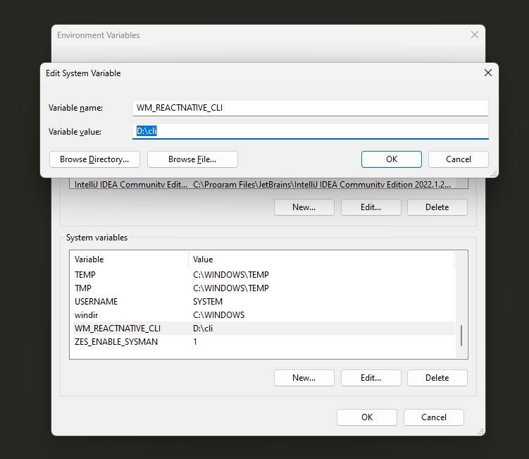
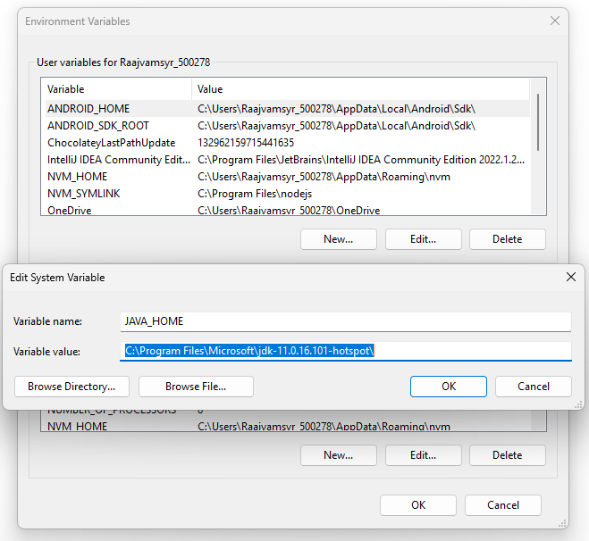

# wm-reactnative-cli

A command line utility to build react native apps created using WaveMaker product.

The main goal of wm-reactnative-cli is to simplify generation of APK or IPA for WaveMaker developers. ```wm-reactnative-cli``` combines multiple react-native commands into a single command. First, one has to make sure all the required hardware and software are available and installed. Then execute the command with the appropriate values for arguments.

### Command to Install

~~~
npm install -g @wavemaker/wm-reactnative-cli
~~~

### Adding Environment Variable

#### For Windows

-   Go to System Setting and Select Environment Variables.

    

-   Select New Variable under the System section and add `WM_REACTNATIVE_CLI` and its respective path.

    

#### For Linux/MAC

-   use nano ~/.bashrc then add the following at the end of the file (after updating the paths) and save it.

~~~
export WM_REACTNATIVE_CLI="$HOME/cli/"
~~~

**_NOTE:_** To avoid cmake errors caused due to long paths in Windows, we suggest making the cli path shorter using this variable

## Android Build

### Requirements

-   Linux or MAC or Windows
-   Node 14.x ([https://nodejs.org/en/blog/release/v14.15.1/](https://nodejs.org/en/download/))
-   GIT ([https://git-scm.com/download](https://git-scm.com/download))
-   Java 11 ([https://openjdk.org/install/](https://openjdk.org/install/))
-   Yarn (npm install -g yarn)
-   Gradle 7 ([https://gradle.org/releases/](https://gradle.org/releases/))
-   Expo cli 5.4.4 (npm install -g expo-cli@5.4.4)
-   Make sure JAVA_HOME, ANDROID_SDK and GRADLE_HOME are set in the environment variables and also in PATH.

#### Adding Environment Variables

#### For Windows

-   Go to System Setting and Select Environment Variables.
    
    
-   Select New Variable under the System section and add variables and their respective paths.
    

#### For Linux/MAC

-   use nano ~/.bashrc then add the following at the end of the file (after updating the paths) and save it.
~~~
export JAVA_HOME="/usr/lib/jvm/java-11-openjdk-amd64"
export ANDROID_HOME="/usr/lib/android-sdk"
export ANDROID_SDK="/usr/lib/android-sdk"
export ANDROID_SDK_ROOT="/usr/lib/android-sdk"
export GRADLE_HOME="$HOME/gradle/gradle-7.5.1"
~~~

### Command

wm-reactnative build android <src_dir> [additional_arguments]


|&nbsp;&nbsp;&nbsp;&nbsp;&nbsp;&nbsp;&nbsp;&nbsp;&nbsp;&nbsp;&nbsp;&nbsp;&nbsp;&nbsp;&nbsp;&nbsp;&nbsp;&nbsp;&nbsp;**Argument**&nbsp;&nbsp;&nbsp;&nbsp;&nbsp;&nbsp;&nbsp;&nbsp;&nbsp;&nbsp;&nbsp;&nbsp;&nbsp;&nbsp;&nbsp;&nbsp;&nbsp;&nbsp;&nbsp;| **Description** |
|--|--|
| **src_dir** | **DEFAULT:** current working directory.<br> Path to the reactnative expo zip (or) path to the reactnative expo project folder. |
|**\-\-dest**|**OPTIONAL:** directory where the app has to be copied and built. If it is not specified then .wm-reactnative-cli folder inside the home directory, will contain the build folders |
|**\-\-auto-eject**|**OPTIONAL:** On setting this flag to true, expo eject will be invoke automatically.|
|**\-\-aKeyStore**|Absolute path of the key store. If keystore is not given then android debug key is used.|
|**\-\-aStorePassword**|Password to key store|
|**\-\-aKeyAlias**|Alias name of the key|
|**\-\-aKeyPassword**|Key Password|
|**\-\-buildType**|**DEFAULT:** development<br>development or production<br>Use ‘production’ with keystore specified.|


### Example 1

~~~
wm-reactnative build android "/path/to/src"
~~~
### Example 2
~~~
wm-reactnative build android "/path/to/src" \
--dest="/path/to/dest" \
--aKeyStore="/path/to/file.keystore" \
--aStorePassword="store_password" \
--aKeyAlias="key_alias_name" \
--aKeyPassword="key" \
--buildType="production"
--auto-eject=true
~~~

## IOS build

### Requirements

-   MAC machine
-   Latest XCODE
-   CocoaPods ([https://guides.cocoapods.org/using/getting-started.html#toc_3](https://guides.cocoapods.org/using/getting-started.html#toc_3))
-   Node 14.x ([https://nodejs.org/en/blog/release/v12.22.0/](https://nodejs.org/en/download/))
-   GIT ([https://git-scm.com/download/mac](https://git-scm.com/download/mac))
-   Yarn (npm install -g yarn)
-   Expo cli 5.4.4 (npm install -g expo-cli@5.4.4)
-   Apple developer or distribution P12 certificates
-   Provisioning profile
-   Install wm-reactnative-cli (npm install -g @wavemaker/wm-reactnative-cli)
-   For development build, development certificate and development provisioning file are required.
-   For production build, distribution certificate and distribution provisioning file are required.

**NOTE:** Before building an app, please make sure that neither iPhone nor iPad is not connected to Mac.

### Command

wm-reactnative build ios <src_dir> [additional_arguments]


|&nbsp;&nbsp;&nbsp;&nbsp;&nbsp;&nbsp;&nbsp;&nbsp;&nbsp;&nbsp;&nbsp;&nbsp;&nbsp;&nbsp;&nbsp;&nbsp;&nbsp;&nbsp;&nbsp;**Argument**&nbsp;&nbsp;&nbsp;&nbsp;&nbsp;&nbsp;&nbsp;&nbsp;&nbsp;&nbsp;&nbsp;&nbsp;&nbsp;&nbsp;&nbsp;&nbsp;&nbsp;&nbsp;&nbsp;&nbsp;&nbsp;| **Description** |
|--|--|
| **src_dir** | **DEFAULT:** current working directory.<br> Path to the reactnative expo zip (or) path to the reactnative expo project folder. |
|**\-\-dest**|**OPTIONAL:** directory where the app has to be copied and built. If it is not specified then .wm-reactnative-cli folder inside the home directory, will contain the build folders |
|**\-\-auto-eject**|**OPTIONAL:** On setting this flag to true, expo eject will be invoke automatically.|
|**\-\-iCertificate**|Absolute path of P12 certificate location|
|**\-\-iCertificatePassword**|Password to unlock the certificate.|
|**\-\-iProvisioningFile**|Absolute path of provisioning file|
|**\-\-iCodeSigningIdentity**|Signing certificate name in keychain access|
|**\-\-buildType**|**DEFAULT:** development<bR>development or production <br>Use ‘production’ with an AppStore distribution certificate.|


### Example


~~~
wm-reactnative build ios "/path/to/src" \
--iCertificate="/path/to/distribution.p12" \
--iCertificatePassword="unlock_password" \
--iProvisioningFile="/path/to/profile.mobileprovision" \
--iCodeSigningIdentity="certificate name in keychain access" \
--buildType="production"
~~~


## Run Expo

### Requirements
- Node 14.x
- GIT ([https://git-scm.com/download](https://git-scm.com/download))
- npm 7.20.x
- Yarn (npm install -g yarn)
- Expo cli 5.4.4 (npm install -g expo-cli@5.4.4)

### Command

wm-reactnative run expo <preview_url> [additional_arguments]

|&nbsp;&nbsp;&nbsp;&nbsp;&nbsp;&nbsp;&nbsp;&nbsp;&nbsp;&nbsp;&nbsp;&nbsp;&nbsp;&nbsp;&nbsp;&nbsp;&nbsp;&nbsp;&nbsp;**Argument**&nbsp;&nbsp;&nbsp;&nbsp;&nbsp;&nbsp;&nbsp;&nbsp;&nbsp;&nbsp;&nbsp;&nbsp;&nbsp;&nbsp;&nbsp;&nbsp;&nbsp;&nbsp;&nbsp;&nbsp;&nbsp;| **Description** |
|--|--|
| **preview_url** | app preview url |
|**\-\-clean**|**DEFAULT:** false <br> if true, existing project directory is removed |

## Run web-preview

### Requirements
- Node 14.x
- GIT ([https://git-scm.com/download](https://git-scm.com/download))
- npm 7.20.x
- Yarn (npm install -g yarn)
- Expo cli 5.4.4 (npm install -g expo-cli@5.4.4)

### Command

wm-reactnative run web-preview <preview_url> [additional_arguments]

|&nbsp;&nbsp;&nbsp;&nbsp;&nbsp;&nbsp;&nbsp;&nbsp;&nbsp;&nbsp;&nbsp;&nbsp;&nbsp;&nbsp;&nbsp;&nbsp;&nbsp;&nbsp;&nbsp;**Argument**&nbsp;&nbsp;&nbsp;&nbsp;&nbsp;&nbsp;&nbsp;&nbsp;&nbsp;&nbsp;&nbsp;&nbsp;&nbsp;&nbsp;&nbsp;&nbsp;&nbsp;&nbsp;&nbsp;&nbsp;&nbsp;| **Description** |
|--|--|
| **preview_url** | app preview url |
|**\-\-clean**|**DEFAULT:** false <br> if true, existing project directory is removed |

## Run Android

-   Linux or MAC or Windows
-   Node 14.x ([https://nodejs.org/en/blog/release/v14.15.1/](https://nodejs.org/en/download/))
-   GIT ([https://git-scm.com/download](https://git-scm.com/download))
-   Java 11 ([https://openjdk.org/install/](https://openjdk.org/install/))
-   Yarn (npm install -g yarn)
-   Gradle 7 ([https://gradle.org/releases/](https://gradle.org/releases/))
-   Expo cli 5.4.4 (npm install -g expo-cli@5.4.4)
-   Make sure JAVA_HOME, ANDROID_SDK and GRADLE_HOME are set in the environment variables and also in PATH.

### Command

wm-reactnative run android <preview_url> [additional_arguments]

|&nbsp;&nbsp;&nbsp;&nbsp;&nbsp;&nbsp;&nbsp;&nbsp;&nbsp;&nbsp;&nbsp;&nbsp;&nbsp;&nbsp;&nbsp;&nbsp;&nbsp;&nbsp;&nbsp;**Argument**&nbsp;&nbsp;&nbsp;&nbsp;&nbsp;&nbsp;&nbsp;&nbsp;&nbsp;&nbsp;&nbsp;&nbsp;&nbsp;&nbsp;&nbsp;&nbsp;&nbsp;&nbsp;&nbsp;&nbsp;&nbsp;| **Description** |
|--|--|
| **preview_url** | app preview url |
|**\-\-clean**|**DEFAULT:** false <br> if true, existing project directory is removed |


## Run iOS

### Requirements

-   MAC machine
-   Latest XCODE
-   CocoaPods ([https://guides.cocoapods.org/using/getting-started.html#toc_3](https://guides.cocoapods.org/using/getting-started.html#toc_3))
-   Node 14.x ([https://nodejs.org/en/blog/release/v12.22.0/](https://nodejs.org/en/download/))
-   GIT ([https://git-scm.com/download/mac](https://git-scm.com/download/mac))
-   Yarn (npm install -g yarn)
-   Expo cli 5.4.4 (npm install -g expo-cli@5.4.4)


### Command

wm-reactnative run ios <preview_url> [additional_arguments]

|&nbsp;&nbsp;&nbsp;&nbsp;&nbsp;&nbsp;&nbsp;&nbsp;&nbsp;&nbsp;&nbsp;&nbsp;&nbsp;&nbsp;&nbsp;&nbsp;&nbsp;&nbsp;&nbsp;**Argument**&nbsp;&nbsp;&nbsp;&nbsp;&nbsp;&nbsp;&nbsp;&nbsp;&nbsp;&nbsp;&nbsp;&nbsp;&nbsp;&nbsp;&nbsp;&nbsp;&nbsp;&nbsp;&nbsp;&nbsp;&nbsp;| **Description** |
|--|--|
| **preview_url** | app preview url |
|**\-\-clean**|**DEFAULT:** false <br> if true, existing project directory is removed |


## Additional Information

1. Destination folder path is logged at the start of the build.
2. Build log files are present at <destination_folder>/output/logs
3. The artifact built is available at <destination_folder>/output/<platform_type>/. The complete path is printed in log also.
